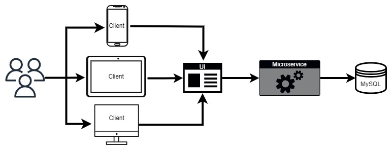

<!-- _paginate: skip -->

# Valor Academy

---
<!-- _class: overview -->
### Overview & Background

- Valor Academy is an innovative learning platform specifically designed to empower individuals in their coding journey. The platform aims to address the challenges faced by aspiring coders by providing a comprehensive and accessible learning environment.

- I understand that learning to code can be a daunting task for many. The complexity of coding languages, limited availability of quality resources, and the high cost of traditional coding bootcamps often act as barriers to entry. I recognized the need for a platform that would democratize coding education and make it accessible to a wider audience.

- One of the key advantages of Valor Academy is its flexibility. Learners can access the platform anytime, anywhere, and at their own pace. Whether you have a busy schedule or prefer to learn at your own convenience, Valor Academy ensures that you have the flexibility to learn coding on your terms.

---
<!-- _class: objective -->
### Objective Statement

- The objective of Valor Academy is to create a comprehensive, user-friendly learning platform that enables users to learn coding skills through interactive material. The platform includes features such as content management, progress tracking, and assessment, as well as user authentication and authorization to ensure secure access.

---
### Technical Architecture

- 2-tier Microservice architecture
  - React App UI
  - Spring Boot Rest API 

- Designed for performance, scalability, and realiability, with a modular and extensible architecture that can support future growth, expansion and adaptability for any business needs

---

### Technical Architecture Continued

---
### Technical Challenges

- Authentication/Authorization
  - JSON Web Token(JWT)
- User Data Encryption
  - BCrypt
- State Management
  - Zustand/LocalStorage
- User Testing
  - Beta Testers

---

### Future Improvements

- Content Creator Account/Dashboard
- Mobile App
- Social Features
- Integration with external services
- Analytics Page
- Language Localization

---
<!-- _paginate: skip -->
### Questions?